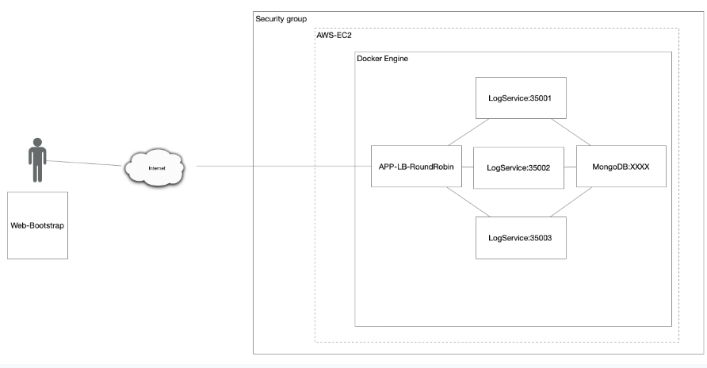

# TALLER DE DE MODULARIZACIÓN CON VIRTUALIZACIÓN E INTRODUCCIÓN A DOCKER

Este proyecto implementa una aplicación que se conecta a una base de datos MongoDB y gestiona tres instancias de la misma utilizando Docker. La arquitectura está diseñada para proporcionar una solución escalable y modular para el manejo de datos.

## Getting Started

Estas instrucciones te guiarán para obtener una copia del proyecto y ejecutarlo en tu máquina local para desarrollo y pruebas.

### Prerequisites

Para instalar y ejecutar el software, necesitas tener instalado:

- **Java Development Kit (JDK):** Puedes descargarlo desde [la página oficial de Oracle](https://www.oracle.com/java/technologies/javase-jdk11-downloads.html) o utilizar OpenJDK.
- **Docker:** Puedes descargar Docker desde [la página oficial](https://www.docker.com/get-started).

### Installing

Sigue estos pasos para configurar el entorno de desarrollo:

1. **Clonar el repositorio:**

   Abre una terminal y clona el repositorio con el siguiente comando:
   ```bash
   git clone https://github.com/ChristianDuarteR/Primer-DockerApp.git

3. Abre el proyecto en tu idl favorito
4. compilalo con mvn clean install
5. Crea tu propia imagen con docker build --tag {tu nombre} o descargala del siguiente repositorio https://hub.docker.com/repository/docker/christianduarter/springdockercompose/general
6. Descarga la imagen de mongo con: 
  docker pull mongo
7. ejecuta el docker-compose.yml con -docker-compose up -d esto creara 5 contenedores corriendo la arquitectura propuesta (Recuerda descargar el repositorio de el front de este proyecto en el repositorio asociado)
8. Todo esta listo y corriendo por el puerto localhost:8080

### Built With

- Maven - Dependency Management

### Docker Configuration
El proyecto está configurado para ejecutarse en Docker con las siguientes instancias:

1. Una instancia de MongoDB
2. Una instancia de RoundRobinApp
3. Tres instancias de la aplicación Spring Boot

### Architecture

- Este proyecto se basa en la siguiente arquitectura

